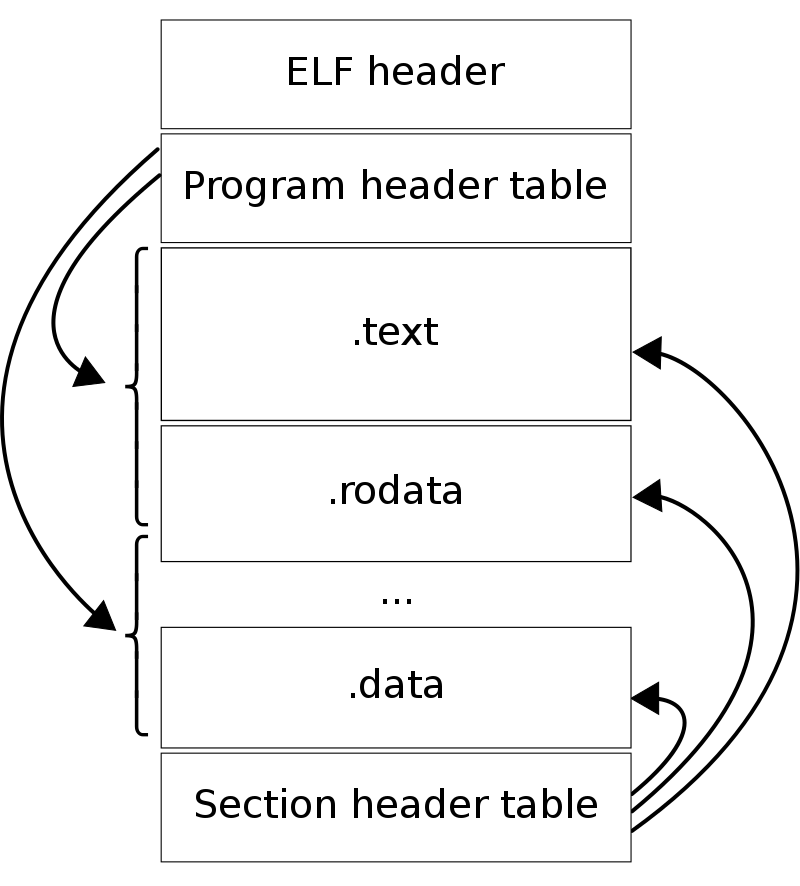

# Hello World

* Code)

```C
#include <stdio.h>

int main(int argc, char** argv)
{
    printf("Hello World\n");
    return 0;
}
```

* Build) `gcc -o hello hello.c`.
* Execute) `./hello`

# Overview

We will use the simple hello world exectuable as a means to 

1) Examine the format and contents of an ELF executable 
2) Give a detailed overview by which a process is actually started up
3) Look at how shared libraries are linked dynamically

# Examining the output (ELF Format and Contents)



* Above is a diagram showing how an ELF file is layed out (as saved on disk)
* `readelf -a hello` dumps entire output file and gives human readable overview of its contents
* The ELF file contents are defined by C structures declared in `/usr/include/elf.h`. 
* The ELF header contains meta data on exe. More importantly it points to program header and section header, the two ways the contents of an ELF are organized or structured.

```
ELF Header:
  Magic:   7f 45 4c 46 02 01 01 00 00 00 00 00 00 00 00 00 
  Class:                             ELF64
  Data:                              2's complement, little endian
  Version:                           1 (current)
  OS/ABI:                            UNIX - System V
  ABI Version:                       0
  Type:                              DYN (Shared object file)
  Machine:                           Advanced Micro Devices X86-64
  Version:                           0x1
  Entry point address:               0x1060
  Start of program headers:          64 (bytes into file)
  Start of section headers:          14712 (bytes into file)
  Flags:                             0x0
  Size of this header:               64 (bytes)
  Size of program headers:           56 (bytes)
  Number of program headers:         13
  Size of section headers:           64 (bytes)
  Number of section headers:         31
  Section header string table index: 30
```

## Section Header:
```
$ readelf -S --wide hello
There are 31 section headers, starting at offset 0x3978:

Section Headers:
  [Nr] Name              Type            Address          Off    Size   ES Flg Lk Inf Al
  [ 0]                   NULL            0000000000000000 000000 000000 00      0   0  0
  [ 1] .interp           PROGBITS        0000000000000318 000318 00001c 00   A  0   0  1
  [ 2] .note.gnu.property NOTE            0000000000000338 000338 000020 00   A  0   0  8
  [ 3] .note.gnu.build-id NOTE            0000000000000358 000358 000024 00   A  0   0  4
  [ 4] .note.ABI-tag     NOTE            000000000000037c 00037c 000020 00   A  0   0  4
  [ 5] .gnu.hash         GNU_HASH        00000000000003a0 0003a0 000024 00   A  6   0  8
  [ 6] .dynsym           DYNSYM          00000000000003c8 0003c8 0000a8 18   A  7   1  8
  [ 7] .dynstr           STRTAB          0000000000000470 000470 000082 00   A  0   0  1
  [ 8] .gnu.version      VERSYM          00000000000004f2 0004f2 00000e 02   A  6   0  2
  [ 9] .gnu.version_r    VERNEED         0000000000000500 000500 000020 00   A  7   1  8
  [10] .rela.dyn         RELA            0000000000000520 000520 0000c0 18   A  6   0  8
  [11] .rela.plt         RELA            00000000000005e0 0005e0 000018 18  AI  6  24  8
  [12] .init             PROGBITS        0000000000001000 001000 00001b 00  AX  0   0  4
  [13] .plt              PROGBITS        0000000000001020 001020 000020 10  AX  0   0 16
  [14] .plt.got          PROGBITS        0000000000001040 001040 000010 10  AX  0   0 16
  [15] .plt.sec          PROGBITS        0000000000001050 001050 000010 10  AX  0   0 16
  [16] .text             PROGBITS        0000000000001060 001060 000185 00  AX  0   0 16
  [17] .fini             PROGBITS        00000000000011e8 0011e8 00000d 00  AX  0   0  4
  [18] .rodata           PROGBITS        0000000000002000 002000 000010 00   A  0   0  4
  [19] .eh_frame_hdr     PROGBITS        0000000000002010 002010 000044 00   A  0   0  4
  [20] .eh_frame         PROGBITS        0000000000002058 002058 000108 00   A  0   0  8
  [21] .init_array       INIT_ARRAY      0000000000003db8 002db8 000008 08  WA  0   0  8
  [22] .fini_array       FINI_ARRAY      0000000000003dc0 002dc0 000008 08  WA  0   0  8
  [23] .dynamic          DYNAMIC         0000000000003dc8 002dc8 0001f0 10  WA  7   0  8
  [24] .got              PROGBITS        0000000000003fb8 002fb8 000048 08  WA  0   0  8
  [25] .data             PROGBITS        0000000000004000 003000 000010 00  WA  0   0  8
  [26] .bss              NOBITS          0000000000004010 003010 000008 00  WA  0   0  1
  [27] .comment          PROGBITS        0000000000000000 003010 00002b 01  MS  0   0  1
  [28] .symtab           SYMTAB          0000000000000000 003040 000618 18     29  46  8
  [29] .strtab           STRTAB          0000000000000000 003658 000203 00      0   0  1
  [30] .shstrtab         STRTAB          0000000000000000 00385b 00011a 00      0   0  1
Key to Flags:
  W (write), A (alloc), X (execute), M (merge), S (strings), I (info),
  L (link order), O (extra OS processing required), G (group), T (TLS),
  C (compressed), x (unknown), o (OS specific), E (exclude),
  l (large), p (processor specific)
```
* The view of the ELF the linker uses
* Is a table composed of sections
* Address is virt addr when exe is loaded, offset is where this section is located within ELF file
* Table reserves certain parts of memory for various parts of a programs memory footprint.

| Section | Description | Value | 
| --- | --- | --- |
| *NULL* | First section is always null section | - |
| .interp | Contains C string of location of dynamic linker | /lib64/ld-linux-x86-64.so.2 |
| .note.gnu.property | Meta Data Note | x86 feature IBT and SHSTK |
| .note.gnu.build-id | Meta Data Note | Build ID 0d098f5807214fb4a10978181b153fcb7b09af2a |
| .note.ABI-tag | Meta Data Note | OS: Linux, ABI: 3.2.0 |
| .gnu.hash | Hash table for looking up symbols in smbol table | - |
| .dynsym | Dynamic Symbols to be resolved during runtime linking | - |
| .dynstr | ASCII strings of names of symbols in dyamic symbol table | libc.so.6, puts, __cxa_finalize, __libc_start_main, GLIBC_2.2.5, _ITM_deregisterTMCloneTable, __gmon_start__, _ITM_registerTMCloneTable |
| .gnu.version | Meta Data on GNU Version | GLIBC 2.2.5 |
| .gnu.version_r | Versioning see [4] | - |
| .rela.dyn | Relocation table for fixup of dynamic symbols | - |
| .rela.plt | Relocation table for the fixup of dynamic functions | - |
| .init | Code section to call gprof init if flag set in complier (and possibly other init code to be ran prior to entry of program) | Run `objdump -d hello` | 
| .plt | Code section for Procedural Linkage Table. Involved in Dynamic Linking | Run `objdump -d hello` |
| .plt.got | Code section for PLT Global Offset table. Involved in Dynamic Linking | Run `objdump -d hello` |
| .plt.sec | Code section involved in dynamic linking | Contains the defintion of <puts@plt> |

## Program Header:
* The view when loading an executable into memory.
* Table of segments
    * Which themselves are composed of sections.
* Appears to describe program layout in memory.

## Questions
* **Q** When I run `./hello` how does it know read ELF header and process it accordingly.
    * **A** ELF file formats defined at `/usr/include/elf.h`
* **Q** What exactly happens when I excute this bash command?
    * **A** 
* **Q** In program header why is virt addr and phys addr the same?
* **Q** In program header why is stack mem size 0?
* **Q** How does it determine entry point?
    * **A** Matches with offset of .text. This must be where actual machine code of program is stored within ELF?
* **Q** Interpeter `/lib64/ld-linux-x86-64.so.2`??
    **A** This is the dynamic linker and is present in all shared library object files. When the program is ran, both this elf and `hello` are loaded into memory. Execution is first passed to the dynamic linker that resolves undefined symbols and handles linking shared libraries.
* **Q** In Section header, addr and off match up until eh_frame, why?
* **Q** GNU Hash?
* **Q** Why is printf not in .dynstr?
    * **A** Compiler optimizes this to puts which is a function for putting a string on STDOUT
* **Q** How are all this sections used in linking?
    * **A**
* **Q** What is __gmon_start and what is it called in .init?
    * **A** Appears to be an init function pointer symbol for a profiling tool, gprof. If compiled with the profiling flags on, this will be called prior to entry into the main prog.
* **Q** When is the .plt, .plt.got and .plgt code section called?
* **Q** `bnd jmpq`, `endbrk`, `nopl` instructions?
* **Q** Does every dynamically linked function get an entry in 

## Resources
* [1] https://en.wikipedia.org/wiki/Executable_and_Linkable_Format
* [2] https://github.com/compilepeace/BINARY_DISSECTION_COURSE/blob/master/ELF/ELF.md
* [3] https://lwn.net/Articles/631631/
* [4] https://refspecs.linuxfoundation.org/LSB_3.0.0/LSB-PDA/LSB-PDA.junk/symversion.html

# Process Start Up


## Resources

* [10] http://dbp-consulting.com/tutorials/debugging/linuxProgramStartup.html

# Dynamic Linking

## Resources

* [20] https://www.airs.com/blog/index.php?s=Linkers