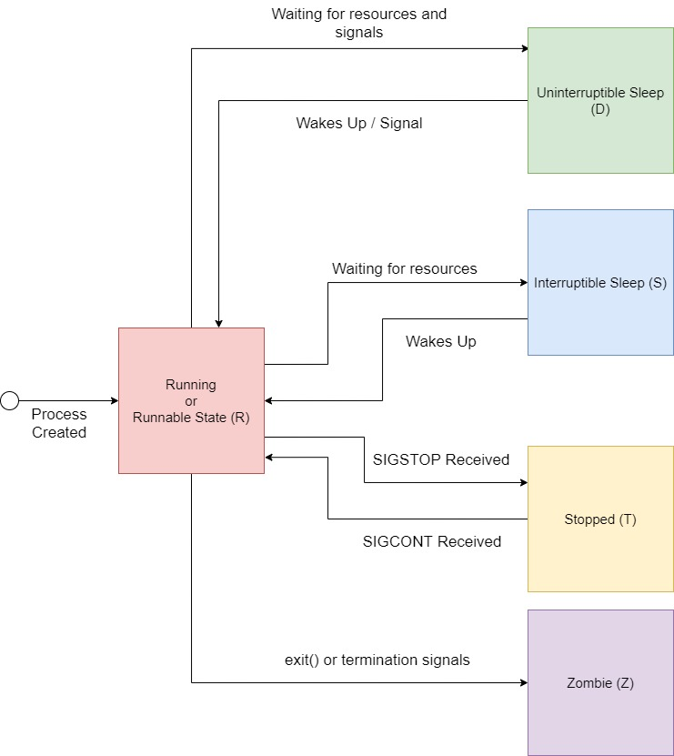

# Processes and Threads

In previous sections we looked at hello world and saw that our hello world PROGRAM gets encapuslated in the Linux concept of a process. This is what we shall look at here. At a high level a process is a "thread" of execution of a program that also has certain associated resources. These are:

* A Stack
* Virutal Memory
* Open Files
* Signal Handlers
* Etc

Processes are created in linux by copying or forking an existing process. All processes besides the init process have a single parent. Thus this makes the set of all processes on a system a tree. Processes have many relavent system calls and we will explore them in depth in this section:

* `Fork()`
* `Clone()`
* `Exec()`
* `Waitpid()`
* `Getpid()`
* `Getppid()`
* `Exit()`
* `wait4()`
* `getpgid()`
* `setpgid()`
* `gettid()`

In this installment we want to take a fairly detailed look at Linux Processes, how thier created, manipulated, and what precisely a process is composed of.

# Process Creation, Manipulation, and Execution

## Identifying and Grouping Processes

As we've seen and explained many times a process gets created by copying an existing process. It has a field called a `pid` that can be accesed via the `getpid` system call that uniquely identifies a process on the system. Processes also maintain a `ppid` field which gives the `pid` of its parent. These two identify where a process sits in the process tree and who owns that process.

Processes can also be grouped into a collection called ... well a group. By default the group ID of process launched is given a group ID = to its own pid. If this process then forks any children, that child inherits th group id of its paretn unless its parent or itself change its group ID. Note that if an exec call is used, the parent can no longer change the gid of its child. Group IDs exist so that process can be manipuled and communicated with in groups in stead of indivdually. In the file `proc.c` we give an example of how using these system calls work and how PIDs and GPIDs work.

In `proc.c` we create process tree with a parent that has two children and one of its own children also has a child. If `child1_in_own_grp = 0`, then all children belong to the same process group whose ID is that of the pid of the parent. Now if we set `child1_in_own_grp = 1`, then all children including the grand child get put into a process group whose ID is that of the first child. This case shows how we can move children into differnt groups to simplify book keeping

## Process State, Reaping, and Zombie Processes

Notice that in `proc.c` we make use of the `waitpid` system call. This system call waits until a process dies and allows us to get the exit status of our child process. `waitpid` can be used to wait for any child, a specific child, or even any child in a specific process group. The `waitpid` system call also has options for non blocking calls, returing if a child is stopped and not just terminated (more on this later), or has previously been stopped and is now resumed. Finally, the `waitpid` system call is actually implemented in libc. The actual underlying system call is `wait4`, which takes the exact same arguments as `waitpid` put has an additional pointed to a runtime usage struct that gives us some details about the processes excution. Again more on this later.

Now it turns out that `waitpid` is more that a control flow call and it is 100% fundamental to the cleaning up of a process. If one does not call `waitpid` on its child process, the child enters a state called being a "zombie". It is terminated but its in kernel data structure is still maintained in memory. The process of calling `waitpid` on a child process is called "reaping". If a parent exits and does not reap its child, this child becomes an orphan. Orphans will be adopted by the init process and a linux service will reap them periodically. `proc.c` shows the proper way to deal call `waitpid` on chidren so as to avoid making them an orphan.

Processes have a state associated with them and they move from state to state depending on their execution. This creates a state machine. Below is this state machine.



A process starts in the runnable state which does not mean it is actively running, instead it means it eligible to be put on the processes run Q to be ran when it is its turn to run. The sleeping states correspond to waiting on IO or other events. Some sleep states are uninterruptable. The opposite is true of being in an interruptable sleep where any signal will wake up a process. A stopped state indicated a process has recieved a stop signal and will not resume exection until a continue signal has been issued to the process. Finally, the termination or zombie state is when a process exits but has not been reaped.

In `state.c` we give some cases to explore the different states a process can be in. If `do_sleep=1` , then the parent process sleeps for 60s. One can then see the process state by running `cat /proc/$!/status | grep state`. This uses the procfs interface to look at the state status of the most recently ran process by the shell. If `do_unreaped_child=1`, then one can use the child pid instead of the `$!` shorthand to see the state of child that has not been reaped yet. Finally, the last case `do_stop_child=1` shows how to use signals to stop and continue a process.

## Resources

* https://www.baeldung.com/linux/process-states
* https://www.win.tue.nl/~aeb/linux/lk/lk-10.html
* https://linux-kernel-labs.github.io/refs/heads/master/so2/lec3-processes.html
* https://tldp.org/LDP/tlk/kernel/processes.html
* [CSAPP CH 8](../Computer%20Systems%20A%20Programmers%20Perspective%20(3rd).pdf)

# Threads and Clone

Threads are similar to a process in that they are an execution of a program. They have a stack and a register state. They differ from a process in that they usually share many resources that are ususally unique to a process. At the OS level threads and processes are treated the same and are generalized into a schedulable object called a task. We saw in many previous discussions the use of the system call `fork`. This systemcall is implemented using the more fine grain system call `clone`. Its signature is shown below.

```C
long clone(
    unsigned long flags, 
    void *stack,
    int *parent_tid, 
    int *child_tid,
    unsigned long tls
);
```

## Flags

The flags supplied to `clone` give us a good idea at what resources a process posesess and gives us control over what resources are shared. Below is a list of these resources. The exact list can be looked up using the manual entry i.e. `man clone`.

* TID - Thread ID. Used to identify a thread amoungst a thread group.
* Signal Handlers - Default or shared. 
* FD Table - File descriptor table
* File System
    * cwd
    * root
    * umask
* I/O context - whether or not the threads share scheduling time slices for the IO scheduler.
* Namespaces
    * cgroup
    * net
    * mount
    * UTS
    * user
* PID
* Parent - Whether or not the calling process is considered the parent.
* Tracing - Can make a thread untraceable
* Can be started in a stopped state
* CLONE_THREAD - whether or not spawned process is in same thread group. Thread groups are threads that all share the same PID.
* Memory Space - Share same virtual address tables or not.
* TGID - Thread group ID

## Other args

The stack arg allows us to give our thread a dedicated memory chunk for its stack. If NULL it will use the parents stack. However, if the child thread also shares the same memory space than this will cause issues as they will be using the same underlying physical memory. Otherwise if not using the same virtual memery, as in fork, copy on write semantics will be used to ensure pages are physically different. The TID args are the locations where the system call will update the parent and childs TID. Finally, TLS stands for thread local storage and in x86-64 the meaning of this arg is to be the of the spawned threads `%fs` base register. Discussion of this is outside of our scope and can be uncovered by investigating thread local storage.

## Exercise

In this exercise we simply want to write a clone system call wrapper that doesn't use glibc or pthreads. This turned out to be more challanging than one would expect. First we had to implement and figure out how to use `mmap`. This lead to a discovery that C calling conventions and those used by the `syscall` instruction are slightly different. So, when we wrote this wrapper in lib_meme we had to include the following assembly:

```C
 asm(
        "mov %rcx, %r10\n"
        "mov $56, %rax\n"
        "syscall\n"
    );
```

Next it was time implement the syscall `clone`. This turns out to be tricky, we call our lib_meme wrapper to execute the system call. However we pass a fresh stack to clone for use by the child and thus when the liv_meme wrapper returns it as no return address to return to. So we used the `tls` param passed to clone to pass a location to jump to. We played with the `CLONE_CHILD_SETTID` and `CLONE_PARENT_SETTID` to see how we can pass locations to the `clone` system call to update. This turned out to be not really useful as the return value from clone is the child_tid (in the parents context) and 0 in the childs context, but we can use the `gettid()` system call to get the child tid in the childs context.

Ideally we would do a deeper dive on how clone works, thread local storage, etc. However, the goal of this section was to learn about processes. This very basic overview of threads shows how threads and processes are more or less the same at the OS level and we saw how we can finely control precisely what resources they share.

# Process Resources

We saw with threads that we have a god control over what resources are shared between parent and child. Thus in this section we want to be a bit more precise and exhaustivly look at these resources

## ProcFS

The procFS file system gives userspace a glance into how the kernel sees a process. We have an [appendix item](../Appendix/Linux%20Kernel%20Interfaces/ProcFS/) that describes it in full detail. However, for now one should now a processes procfs entry is located at `/proc/<pid>`

## IDs and Namespaces

* `man namespaces`
* `man pid_namespaces`
* `setns()`
* `unshare()`
* https://blog.quarkslab.com/digging-into-linux-namespaces-part-1.html
* /proc/$$/ns

```C
struct upid {
    int nr;  /* the pid value */
    struct pid_namespace *ns;       /* the namespace this value
                                    * is visible in */
    struct hlist_node pid_chain; /* hash chain for faster search of PIDS in the given namespace*/
};

struct pid {
    atomic_t count; /* reference counter */
    struct hlist_head tasks[PIDTYPE_MAX]; /* lists of tasks */
    struct rcu_head rcu;
    int level;              // number of upids
    struct upid numbers[0];  // array of pid namespaces
};
```

## (Virtual) Memory

## Files, File System and IO

## Signals

## IPC

## Networking

## Runtime Stats

```C
struct rusage {
    struct timeval ru_utime; /* user CPU time used */
    struct timeval ru_stime; /* system CPU time used */
    long   ru_maxrss;        /* maximum resident set size */
    long   ru_ixrss;         /* integral shared memory size */
    long   ru_idrss;         /* integral unshared data size */
    long   ru_isrss;         /* integral unshared stack size */
    long   ru_minflt;        /* page reclaims (soft page faults) */
    long   ru_majflt;        /* page faults (hard page faults) */
    long   ru_nswap;         /* swaps */
    long   ru_inblock;       /* block input operations */
    long   ru_oublock;       /* block output operations */
    long   ru_msgsnd;        /* IPC messages sent */
    long   ru_msgrcv;        /* IPC messages received */
    long   ru_nsignals;      /* signals received */
    long   ru_nvcsw;         /* voluntary context switches */
    long   ru_nivcsw;        /* involuntary context switches */
};
```

## Linux Proc / Task structure


# What are all these processes on my system

# Questions

* What are these "sys/*" includes? Are the libc or system headers?
